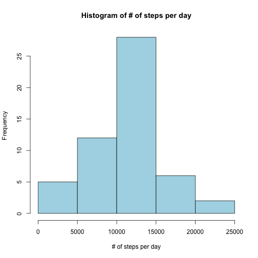

## Loading and preprocessing the data
The following code sets the working directory and loads the data and relevant packages

```r
library(dplyr)
library(ggplot2)
library(lubridate)
setwd("~/Documents/Online Courses/Johns Hopkins Data Science Specialization/Course 5 - Reproducible Research")
data <- read.csv("activity.csv", stringsAsFactors = FALSE)
```

## What is mean total number of steps taken per day?
The following code uses dplyr to group and sum by day, then make a histogram

```r
histData <- data %>% group_by(date) %>% summarize(DailySum = sum(steps))
hist(histData$DailySum, xlab="# of steps per day", 
     main="Histogram of # of steps per day", col="lightblue")
```

 

The following code calculates a table of the mean and median # of steps per day.
The question is slightly confusing, as it could mean "for each day, calculate the
mean and median # of steps" which would give 61 different mean/median values.
But it seems more logical to calculate the mean and median across the already
aggregated daily data sets

```r
mean(histData$DailySum, na.rm = TRUE)
```

```
## [1] 10766.19
```

```r
median(histData$DailySum, na.rm = TRUE)
```

```
## [1] 10765
```

## What is the average daily activity pattern?

The following code uses dplyr to group by interval across all days, finds the 
average, plots a timeseries graph, and finds which interval contains the max # 
of steps


```r
AvgDaily <- data %>% group_by(interval) %>% 
    summarize(AvgPerInterval = mean(steps, na.rm = TRUE))
ggplot(AvgDaily, aes(x = interval, y = AvgPerInterval)) + geom_line()
```

 

```r
AvgDaily$interval[which.max(AvgDaily$AvgPerInterval)]
```

```
## [1] 835
```

## Imputing missing values

Calculate and report the total number of missing values in the dataset (i.e. the total number of rows with NAs)


```r
sum(is.na(data$steps))
```

```
## [1] 2304
```

Recognizing that both the mean and the median could be valuable in imputing missing values, the following code finds the mean and median for each interval and then
takes the average of those two values to find a composite imputed value for each interval


```r
DailyStats <- data %>% group_by(interval) %>% 
    summarize(AvgPerInterval = mean(steps, na.rm = TRUE),
              MedPerInterval = median(steps, na.rm = TRUE))
DailyStats$Imputed <- (DailyStats$AvgPerInterval + DailyStats$MedPerInterval)/2
```

A new dataset is created that is equal to the original dataset but with the missing data filled in

```r
dataImputed <- data
dataImputed <-  merge(dataImputed, DailyStats, by = "interval", all.x = TRUE)
dataImputed <- dataImputed %>% arrange(date, interval)
dataImputed$steps[is.na(dataImputed$steps)] <- dataImputed$Imputed[is.na(dataImputed$steps)]
```

Make a histogram of the total number of steps taken each day and calculate and report the mean and median total number of steps taken per day

```r
histDataImputed <- dataImputed %>% group_by(date) %>% summarize(DailySum = sum(steps))
hist(histDataImputed$DailySum, xlab="# of steps per day", 
     main="Histogram of # of steps per day (with imputed data)", col="lightgreen")
```

 

```r
mean(histDataImputed$DailySum, na.rm = TRUE)
```

```
## [1] 10135.03
```

```r
median(histDataImputed$DailySum, na.rm = TRUE)
```

```
## [1] 10395
```

Do these values differ from the estimates from the first part of the assignment? What is the impact of imputing missing data on the estimates of the total daily number of steps?

```r
mean(histDataImputed$DailySum, na.rm = TRUE) - mean(histData$DailySum, na.rm = TRUE)
```

```
## [1] -631.1599
```

```r
median(histDataImputed$DailySum, na.rm = TRUE) - median(histData$DailySum, na.rm = TRUE)
```

```
## [1] -370
```
In this example, imputing missing data reduces the estimates of total daily # of steps because it replaces NAs (which were removed from the original calculations) with values lower than the original mean and median

## Are there differences in activity patterns between weekdays and weekends?
Uses lubridate to convert date string into POSIXct, find day of week, and then uses ifelse to create "weekday"/"weekend" variable

```r
dataImputed$date <- ymd(data$date)
dataImputed$wday <- wday(data$date)
dataImputed$DayOrEnd <- ifelse(dataImputed$wday == 1 | dataImputed$wday == 7,
                               "weekend", "weekday")
```

Aggregate by weekday/weekend and interval using dplyr

```r
AvgDayEnd <- dataImputed %>% group_by(DayOrEnd, interval) %>% summarize(AvgPerInterval = mean(steps))
```

Plot the graph

```r
ggplot(AvgDayEnd, aes(x = interval, y = AvgPerInterval)) + 
    geom_line() + facet_grid(DayOrEnd ~ .) + ylab("Number of steps")
```

 


